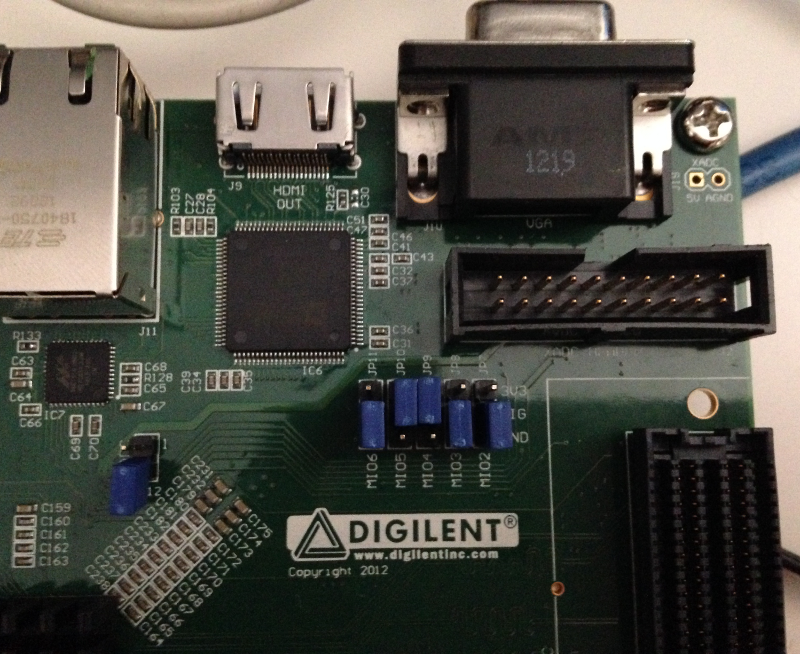

Let's boot
==========

To properly boot the board, you need several components:

* an **SD card**,

* file **BOOT.BIN**,

* the **Linux kernel image**,

* the **device tree blob**,

* a **bootscript**, and

* a **root file system**.

This section will guide you through all that stuff.

SD card
-------

The SD card has to be prepared with two partitions:

* a *FAT16* partition able to contain the following files: *BOOT.BIN*, *uEnv.txt*, *uImage* and *devicetree.dtb*. 64MB will be more than enough

* an *EXT2* partition to contain the root file system

The SD card has to be inserted in **J12**.

Furthermore, on the board there is a set of switches related to the boot process. Verify @board@
boot mode (JP7-JP11) and MIO0 (JP6) jumpers are set like in the following picture:

that means *boot from SD card*, as described in the Hardware User Guide:

 `http://www.zedboard.org/documentation/1521 <http://www.zedboard.org/documentation/1521>`_

BOOT.BIN
--------

To boot the board, the first thing you should care about is the *boot file*.
The *boot file* is composed by up to three components:

1. a **First Stage BootLoader**,

2. a valid **Bitstream** (this is optional), and

3. **u-boot**.

Its name is **BOOT.BIN**.

This guide won't treat the creation of the *Bitstream* and the *First Stage BootLoader*.
For information about those components, please refer to Xilinx's official documentation:

* `Bitstream <http://www.xilinx.com/support/documentation/sw_manuals/xilinx11/ise_p_generate_fpga_programming_file.htm>`_,

* `First Stage BootLoader <http://www.wiki.xilinx.com/Build+FSBL>`_.

A guide on how to prepare file **BOOT.BIN** is available here:

 `http://www.wiki.xilinx.com/Prepare+boot+image <http://www.wiki.xilinx.com/Prepare+boot+image>`_

This SDK relies on a pre-generated *BOOT.BIN*, which can be downloaded from here:

 `Download file BOOT.BIN <_static/BOOT.BIN>`_

**BOOT.BIN** has to be copied in the first partition of the SD card you use to boot the board.

Kernel
------

Yocto generates the Linux kernel image ready to be deployed on the board when you build *virtual/kernel*
or an image (see :ref:`Bitbake <bitbake_label>` Section for more information on how to use *Bitbake*).
You will find it inside directory:

.. host::

 | /home/@user@/architech_sdk/architech/@board-alias@/yocto/build/tmp/deploy/images/@machine-name@/uImage

**uImage** has to be copied to the first partition of the SD card.

Device Tree
-----------

The Flattened Device Tree (FDT) is a data structure for describing the hardware in a system.
It is a derived from the device tree format used by *Open Firmware* to encapsulate platform
information and convey it to the operating system. The operating system uses the FDT data to
find and register the devices in the system. 

The Device Tree Source (*.dts*) file is a text file containing the specification. The Device
Tree Blob file (*.dtb*) is the blob version of the source one, and it is passed to the Linux
Kernel at boot.

You can get the Device Tree Blob file from here:

 `Download devicetree.dtb <_static/devicetree.dtb>`_

You can get the corresponding Device Tree Source from here:

 `Download devicetree.dts <_static/devicetree.dts>`_

Bootscript
----------

With our flow, the default settings of *u-boot* will cause the Linux boot process to fail.
You need to customize it by means of a file named **uEnv.txt** with these commands in it:

.. host::

 | bootcmd=fatload mmc 0 0x3000000 uImage; fatload mmc 0 0x2A00000 devicetree.dtb; bootm 0x3000000 - 0x2A00000
 | uenvcmd=boot
 |  

.. important::

 Make sure uEnv.txt is terminated by an empty line.

If you prefer, you can download file *uEnv.txt* from here:

 `Download file uEnv.txt <_static/uEnv.txt>`_

*u-boot* will look for *uEnv.txt* automatically at boot.

*uEnv.txt* has to be copied to the first partition of the SD card.

RootFS
------

Every time you build an image recipe with :ref:`Bitbake <bitbake_label>` you get
a root file system. All the built root file systems are stacked under directory:

.. host::

 | /home/@user@/architech_sdk/architech/@board-alias@/yocto/build/tmp/deploy/images/@machine-name@/

To deploy the root file system, clear the second partition of the SD card and untar
the root file system tarball Yocto generated directly to the second partition of
the SD card.

Compose the SD card
-------------------

.. warning::

 The following instruction will make you overwrite your SD card content, it will be lost forever!
 If you have important data on it, make sure you do a backup of your data on the SD card before
 catching up with the next steps.

To sum up, the first time you create your SD card, create two partitions on it. The first
one has to be a *FAT16* (name it **boot**), 64MB will be more than enough. Create the second
partition as an *EXT2* (name it **rootfs**), make it big enough to fill the free space on the
disk size.

You are going to need the following files: BOOT.BIN, uEnv.txt, uImage, devicetree.dtb,
*<image>*-@machine-name@.@quickstart-image-extension@.
*<image>* is the recipe name used to build your image, for example: @quickstart-image@, so that
the rootfs tarball name would be @quickstart-image@-@machine-name@.@quickstart-image-extension@.

Now, we assume that the first partition of the SD card gets mounted (in your SDK virtual machine)
under:

.. host::

 | /media/boot

while the second partition gets mounted under:

.. host::

 | /media/rootfs

.. warning::

 If that's not the case for your configuration, please find out which are the proper mounting points
 for those two partitions on your system and replace them in the following instructions.

Furthermore, we assume you previously downloaded files *BOOT.BIN*, *uEnv.txt*, and *devicetree.dtb* inside directory:

.. host::

 | /home/@user@/Documents/@board-alias@

Ok then, we can finally deploy bootloader and kernel on the first partition of the SD card:

.. host::

 | cp /home/@user@/Documents/@board-alias@/BOOT.BIN /media/boot/
 | cp /home/@user@/Documents/@board-alias@/uEnv.txt /media/boot/
 | cp /home/@user@/Documents/@board-alias@/devicetree.dtb /media/boot/
 | cp /home/@user@/architech_sdk/architech/@board-alias@/yocto/build/tmp/deploy/images/@machine-name@/uImage /media/boot/

and the root file system on the second partition of the SD card:

.. host::
 
 | sudo rm -rf /media/rootfs/*
 | sudo tar @quickstart-image-tar-options@ /home/@user@/architech_sdk/architech/@board-alias@/yocto/build/tmp/deploy/images/@machine-name@/<image>-@machine-name@.@quickstart-image-extension@ -C /media/rootfs/

If you just need to install a new root file system on your SD card, you can execute just the last step.

