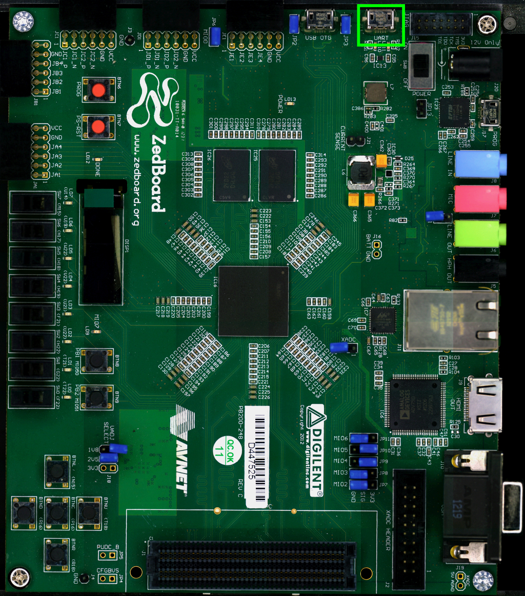

On @board@ there is an USB-UART port (**J14**) labeled **UART**

which you can connect, by means of a micro-USB cable, to your personal computer.

.. note::

 Every operating system has its own killer application to give you a serial terminal interface. In this guide, we are assuming your **host** operating system is **Ubuntu**.

On a Linux (Ubuntu) host machine, the console is seen as a ttyACMX device and you can access to it by means
of an application like *minicom*.

*Minicom* needs to know the name of the serial device. The simplest way for you to discover
the name of the device is by looking to the kernel messages, so:

1. clean the kernel messages

.. host::

 | sudo dmesg -c

2. connect the mini-USB cable to the board already powered-on

3. display the kernel messages

.. host::

 | dmesg

3. read the output

.. host::

 | [29629.785374] usb 3-2: >new full-speed USB device number 4 using xhci_hcd
 | [29629.806908] usb 3-2: >New USB device found, idVendor=04b4, idProduct=0008
 | [29629.806915] usb 3-2: >New USB device strings: Mfr=1, Product=2, SerialNumber=4
 | [29629.806919] usb 3-2: >Product: Cypress-USB2UART-0123456
 | [29629.806922] usb 3-2: >Manufacturer: 2012 Cypress Semiconductor
 | [29629.806925] usb 3-2: >SerialNumber: 0201258B0816
 | [29629.858654] cdc_acm 3-2:1.0: >This device cannot do calls on its own. It is not a modem.
 | [29629.858705] cdc_acm 3-2:1.0: >ttyACM0: USB ACM device
 | [29629.859345] usbcore: registered new interface driver cdc_acm
 | [29629.859347] cdc_acm: USB Abstract Control Model driver for USB modems and ISDN adapters

As you can see, here the device has been recognized as **@console-device@**.

Now that you know the device name, run *minicom*:

.. host::

 | sudo minicom -ws

If minicom is not installed, you can install it with:

.. host::

 | sudo apt-get install minicom

then you can setup your port with these parameters:

.. host::

 | +-----------------------------------------------------------------------+
 | | A -    Serial Device      : /dev/ttyACM0                              |
 | | B - Lockfile Location     : /var/lock                                 |
 | | C -   Callin Program      :                                           |
 | | D -  Callout Program      :                                           |
 | | E -    Bps/Par/Bits       : 115200 8N1                                |
 | | F - Hardware Flow Control : No                                        |
 | | G - Software Flow Control : No                                        |
 | |                                                                       |
 | |    Change which setting?                                              |
 | +-----------------------------------------------------------------------+
 |         | Screen and keyboard      |
 |         | Save setup as dfl        |
 |         | Save setup as..          |
 |         | Exit                     |
 |         | Exit from Minicom        |
 |         +--------------------------+

If on your system the device has not been recognized as *@console-device@*, just replace *@console-device@*
with the proper device.

Once you are done configuring the serial port, you are back to *minicom* main menu and you can select *exit*.

